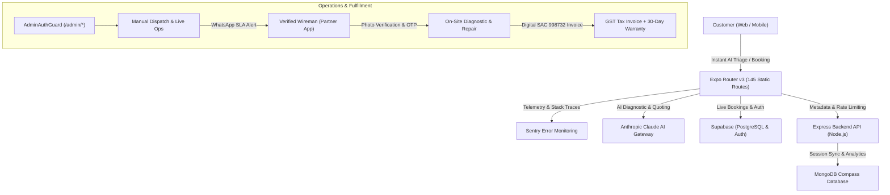

# Sheriyakam (ശരിയാക്കാം) - On-Demand Electrical & Home Services Platform

> **Kerala's On-Demand Emergency Electrician & Home Services Network**  
> Statically exported with Expo Router (145+ routes) • Powered by Supabase, MongoDB, Anthropic Claude AI, and Sentry.

---

## 📌 Architecture & System Overview

Sheriyakam is a production-ready home services dispatch and booking platform connecting homeowners and commercial establishments across all 14 districts of Kerala with verified electrical wiremen and service technicians.



---

## 🛠️ Technology Stack

### Frontend & Mobile
- **Core Framework**: React Native (Expo SDK 52) with Expo Router v3
- **Platform Targets**: Web (Static Pre-Rendering on Vercel), Android, iOS
- **Icons & Design**: Lucide React Native, Custom Glassmorphism UI tokens
- **Error Monitoring**: Sentry client (`services/sentry.js`) with React `<ErrorBoundary>` and `<SectionErrorBoundary>`

### Backend & Database
- **Primary Relational DB**: Supabase (PostgreSQL) with Row-Level Security (RLS)
- **Document & Metadata DB**: MongoDB with Mongoose ORM
- **Authentication**: Supabase Auth with HMAC-SHA256 timing-safe webhook synchronization
- **Server APIs**: Express.js REST API with Helmet security headers, CORS restrictions, and IP rate limiting

### Artificial Intelligence & Automation
- **AI Triage Assistant**: Anthropic Claude API (`services/claudeAiService.js`)
  - Natural-language electrical diagnostic mapping to service catalog
  - Dynamic WhatsApp quotation drafting from technician rough notes
  - Instant auto-response drafting with localized Kerala rate cards
- **Multi-Model Gateway**: Dynamic LLM Gateway (`services/dynamicLlmGateway.ts`) with Gemini, OpenRouter, and Groq failover heuristics

---

## 🚀 Data Flows

### 1. Customer Booking & AI Triage Flow
1. **Intake**: A customer enters an electrical issue in `components/QuickLeadModal.js` or through a district landing page.
2. **AI Triage**: `ClaudeAiService.triageProblem()` analyzes the description, maps it to one of the 6 core catalog services, calculates an estimated price, and assigns an SLA urgency tier (90-Min Emergency / Same-Day / Scheduled).
3. **Repeat Customer Recognition**: `constants/customerStore.js` verifies the phone number against Supabase `customers` table to pre-fill saved addresses and tag the customer with loyalty status.
4. **Dispatch Event**: The booking is saved with status `open`, and `bookingEvents.emit('change')` broadcasts the update to all active dispatch desks.

### 2. Admin Dispatch & Wireman Assignment
1. **Secure Access**: Admins authenticate via `app/admin/_layout.js` (`useAdminAuth()`), which guards all 17 admin sub-routes.
2. **Dispatch Desk**: Operations leads assign the ticket to an active wireman via `app/admin/manual-dispatch.js`.
3. **Automated WhatsApp Alert**: The system generates a formatted WhatsApp dispatch message with address and customer contact.

### 3. On-Site Job Execution & Settlement
1. **Check-In OTP**: The wireman arrives on site and enters the customer's 4-digit check-in OTP (`app/partner/job/[id].js`).
2. **Photo Documentation**: Before/after diagnostic photos are uploaded to Supabase Storage (`job-photos` bucket).
3. **Completion & Payment**: The customer pays via cash or Razorpay payment link. The wireman enters the completion OTP, activating a 30-day rework warranty.
4. **Digital Tax Invoice**: An itemized tax invoice (`app/invoice/[id].js`) is rendered under SAC 998732.

---

## 🔐 Security & Access Control

- ✅ **Admin Route Guard**: `app/admin/_layout.js` enforces authenticated admin sessions across all `/admin/*` screens.
- ✅ **CORS & Rate Limiting**: Express backend enforces origin whitelisting and IP-based rate limiting (10 req/min).
- ✅ **Timing-Safe Webhooks**: Supabase auth webhooks use `crypto.timingSafeEqual` with secret headers.
- ✅ **Fail-Closed AI Gateway**: Zero runtime crashes when offline or when LLM API keys are unconfigured.

---

## 📦 Getting Started

### 1. Prerequisites
- **Node.js**: v18.0.0 or higher
- **Package Manager**: `npm`

### 2. Installation
```bash
git clone https://github.com/sheriyakam/sheriyakam.git
cd sheriyakam
npm install
```

### 3. Environment Variables
Copy `.env.example` to `.env` and configure your credentials:
```env
# Supabase
EXPO_PUBLIC_SUPABASE_URL=https://your-project.supabase.co
EXPO_PUBLIC_SUPABASE_ANON_KEY=your-anon-key

# Sentry Error Monitoring
EXPO_PUBLIC_SENTRY_DSN=https://your-key@o12345.ingest.sentry.io/67890

# AI Gateways (Optional - offline heuristics used if absent)
EXPO_PUBLIC_ANTHROPIC_API_KEY=sk-ant-api03-...
EXPO_PUBLIC_GEMINI_API_KEY=AIzaSy...

# Backend
MONGODB_URI=mongodb://localhost:27017/sheriyakam
PORT=5000
```

### 4. Running Locally
```bash
# Start Expo Web / Mobile Dev Server
npm start

# Run Expo Web directly
npm run web

# Start Express Backend Server
node backend/server.js
```

### 5. Production Build & Static Export
```bash
# Run TypeScript Check
npx tsc --noEmit

# Run ESLint Check
npm run lint

# Export Static Web Build (145+ pages)
npx expo export -p web
```

---

## 👥 Directory Structure

```
sheriyakam/
├── app/                          # 145+ Expo Router screens & route handlers
│   ├── _layout.js               # Global app layout, Sentry init & providers
│   ├── index.js                 # Customer landing & service booking hero
│   ├── admin/                   # Operations & command center
│   │   ├── _layout.js           # AdminAuthGuard protecting all sub-routes
│   │   ├── index.js             # Executive dashboard & metrics
│   │   ├── manual-dispatch.js   # Single-operator live dispatch desk
│   │   ├── live-ops.js          # Real-time 90-min SLA monitor
│   │   └── ...                  # 14 additional administrative tools
│   ├── partner/                 # Electrician partner portal
│   │   ├── index.js             # Partner job queue
│   │   └── job/[id].js          # Job execution, photos & OTP verification
│   ├── booking/[id].js          # Customer real-time booking tracker
│   ├── invoice/[id].js          # GST compliant digital tax invoice
│   └── ...                      # 14 Kerala district SEO landing routes
├── backend/                      # Express.js REST API & AI Daemons
│   ├── server.js                # Express app entrypoint & security middleware
│   └── routes/                  # Auth webhooks & AI routes
├── components/                   # Reusable UI component library & modals
├── config/                       # Supabase & Firebase client configurations
├── constants/                    # Customer, technician, and booking state stores
├── context/                      # React Context providers (Auth, AdminAuth, Theme, Cart)
├── services/                     # Sentry, Claude AI, Storage & Analytics engines
└── utils/                        # Security sanitizers, rate limiters & WhatsApp helpers
```

---

## 📄 License & Compliance

Proprietary © 2026 Sheriyakam. All rights reserved.  
Compliant with the Digital Personal Data Protection Act (DPDP 2023) and Kerala Electrical Inspectorate / KSELB standards.
