# 🚀 Sheriyakam — Autonomous SEO, GEO, Backlink & Content Autopilot Master Playbook

> **Complete Operational System for Search Rankings, AI Answer Engines (ChatGPT, Claude, Perplexity, Gemini, Google AIO), Backlink Authority, and Continuous Content Production.**

---

## 📂 1. Deployed Infrastructure & Endpoints

The following live discovery and indexing assets have been deployed directly to the Sheriyakam project root:

| File | Live URL | Purpose |
| :--- | :--- | :--- |
| `public/robots.txt` | [https://sheriyakam.vercel.app/robots.txt](https://sheriyakam.vercel.app/robots.txt) | Explicitly permits traditional search engines & AI crawlers (`GPTBot`, `ClaudeBot`, `PerplexityBot`, `Google-Extended`, `OAI-SearchBot`, `Applebot-Extended`, `Bytespider`). |
| `public/llms.txt` | [https://sheriyakam.vercel.app/llms.txt](https://sheriyakam.vercel.app/llms.txt) | Standardized markdown knowledge manifest for AI answer engines detailing services, tariffs, and coverage. |
| `public/llms-full.txt` | [https://sheriyakam.vercel.app/llms-full.txt](https://sheriyakam.vercel.app/llms-full.txt) | Deep context dossier with detailed pricing breakdown, Kerala Electrical Inspectorate licensing, and guarantees. |
| `public/sitemap.xml` | [https://sheriyakam.vercel.app/sitemap.xml](https://sheriyakam.vercel.app/sitemap.xml) | Multi-page XML sitemap indexing all key landing, service, legal, and company routes. |
| `public/search.html` | [https://sheriyakam.vercel.app/search.html](https://sheriyakam.vercel.app/search.html) | Interactive **AI Search Tracker (GEO Dashboard)** with live DataForSEO API runner & prompt scorecard across 5 AI engines. |
| `public/backlink-board.html` | [https://sheriyakam.vercel.app/backlink-board.html](https://sheriyakam.vercel.app/backlink-board.html) | Interactive **Backlink Board & Authority Ledger** with DA 88–100 foundation profiles, PR pitch templates, and unlinked mention reclaimer. |
| `app/index.js` | Embedded JSON-LD | Rich `HomeAndConstructionBusiness` Schema with `OfferCatalog` tariffs, `WebSite` Sitelinks search action, and 40–60 word quotable `FAQPage` schema. |

---

## 🤖 2. The 5 Core Pillar Prompt Library

### 🏛️ Pillar 1: The SEO + GEO Autopilot (Technical & On-Page)
**Project Instructions Prompt:**
```text
You are the SEO + GEO analyst and strategist for Sheriyakam (https://sheriyakam.vercel.app), Kerala's premier on-demand electrical and home maintenance platform.
Rules:
- Always pull real data from Google Search Console via GSC MCP before guessing.
- Lead with high-impact, low-effort fixes (Core Web Vitals, Schema, llms.txt).
- Provide a dual scorecard: Google SERP health on one side, AI-search visibility (ChatGPT, Claude, Perplexity, Gemini) on the other.
- Output clean, paste-ready JSON-LD schemas and citable passages.
```

**Skill Prompts:**
1. **The Auditor:**
   > "Audit https://sheriyakam.vercel.app end-to-end. Run the technical crawl, pull my live rankings, impressions and CTR from Search Console, check Core Web Vitals, and score my AI-search readiness out of 100. Give me a baseline scorecard with Google health and AI health side-by-side, flagging the top 5 problems by impact."
2. **The AI-Search Spy:**
   > "Check if Sheriyakam shows up when users ask AI about emergency electrical repair, fan repair, and home wiring in Kerala. Test ChatGPT, Perplexity, Gemini, Claude, and Google AI Overviews. For each: is Sheriyakam cited (yes/no), and if not, the single reason why."
3. **The Diagnoser (Striking Distance Gaps):**
   > "From Search Console data, extract every keyword where Sheriyakam ranks between position 8 and 20. Pull the top questions people ask AI regarding Kerala electricians, classify by intent (Informational / Commercial / Transactional), and identify content gaps."
4. **The Fixer:**
   > "Generate copy-paste ready fixes for the top 3 diagnosed gaps: FAQ schema (JSON-LD), llms.txt updates, and 40–60 word answer-first citable blocks."

---

### ✍️ Pillar 2: The SEO Content Engine (3 Writers)
**The 3 Writers Prompt Architecture:**
1. **The Columnist (`seo-content`):**
   > "Crawl Sheriyakam and pull real GSC queries. Cluster keyword opportunities by intent (Informational, Commercial, Transactional). Draft a high E-E-A-T comprehensive guide for 'Emergency Electrical Safety and Monsoon Wiring in Kerala' including meta title, description, outline, internal links, and JSON-LD schema."
2. **The Refresher (`seo-technical`):**
   > "Pull GSC data comparing the last 28 days vs prior 28 days. Identify pages losing search position or impressions. Diagnose the drag (thin copy, dated FAQs, missing schema) and generate rewritten copy with a changelog."
3. **The Quotable (`seo-geo`):**
   > "Rewrite this passage according to the Quotable Formula: direct answer in sentence 1 (<25 words), self-contained, 1 concrete data point/price, total 40–60 words, question-led, with FAQPage schema."

---

### 🔗 Pillar 3: Backlinks From Zero & The Backlink Engine
**Core Backlink Strategy:**
1. **The Foundation:** Claim DA 88–100 profiles (Google Business, LinkedIn, GitHub, Trustpilot, Crunchbase, Product Hunt, G2).
2. **The Pitch (Source of Sources / HARO):**
   > "Scan today's Source of Sources digests for home service, startup, or regional tech queries. Draft a humanized pitch highlighting Sheriyakam's Kerala Electrical Inspectorate licensing, 90-minute emergency dispatch, and ₹5,00,000 domestic safety insurance cover."
3. **The Mapper (Competitor Gap):**
   > "Extract referring domains of top competitors via Common Crawl and Moz DA. Filter for high-DA do-follow sites that link competitors but not Sheriyakam."
4. **The Reclaimer (Unlinked Mentions):**
   > "Find online mentions of 'Sheriyakam' lacking a hyperlink. Draft a friendly 1-line note asking the publisher to link to https://sheriyakam.vercel.app."

---

### 🔍 Pillar 4: The AI Search Tracker (Live GEO Engine)
**The 4 Moves:**
1. **The Mirror:** Live prompt checks across ChatGPT, Claude, Gemini, Perplexity, and AI Overviews using the deployed `public/search.html` dashboard.
2. **The Detective:** Audit crawler accessibility signals in `robots.txt` and `llms.txt`, and evaluate the most trusted citation hubs.
3. **The Fixer:** Instant deployment of answer-first copy and structured data.
4. **The Witness:** Earning organic mentions on Reddit (r/Kerala, r/Kochi), Quora, and Kerala business journals.

---

## ⏰ 3. Autonomous Autopilot Schedule

Set up these routines using Claude Scheduled Tasks or cron triggers:

```mermaid
gantt
    title Weekly Sheriyakam SEO + GEO Autopilot Cadence
    dateFormat  HH:mm
    axisFormat  %H:%M
    
    section Monday Morning
    Content Refresher (GSC Deltas)        :done, 07:00, 07:30
    AI Search Tracker (Prompt Sweep)       :done, 08:00, 08:30
    Backlink Ledger & Decay Check         :done, 08:30, 09:00
    Competitor Link Gap Analysis          :done, 09:00, 09:30
    
    section Daily Routine
    Daily SERP & GEO Score Logger         :active, 08:00, 08:15
```



---

## 🛠️ 4. Connected MCPs & APIs

- **Google Search Console MCP:** `https://github.com/AminForou/mcp-gsc`
- **DataForSEO MCP:** `https://github.com/dataforseo/mcp-server-typescript`
- **Moz Links API:** `https://moz.com/products/api`
- **Source of Sources:** `https://sourceofsources.com`
