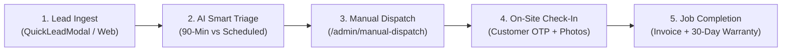

# Sheriyakam (ശരിയാക്കാം) - Founder & Operations Runbook

> **Internal Operations Guide, Emergency SOP & Production Deployment Checklist**  
> **Platform Version:** 1.0.0 Production Release  
> **Service Standard:** Verified Electricians • KSELB Certified

---

## 1. Daily Operations Runbook



### A. Lead Ingest & SLA Monitoring
1. **Accessing the Dispatch Console**:
   - Navigate to `https://sheriyakam.vercel.app/admin/manual-dispatch`.
   - Authenticate with your administrator credentials (managed via `app/admin/_layout.js`).
2. **Monitoring Incoming Requests**:
   - New tickets appear with status `open` and an urgent 90-minute countdown badge.
   - Check the **AI Triage Callout**: The Claude AI engine automatically flags the probable fault (e.g., *Run Capacitor failure*, *Phase Overload*) and suggests catalog pricing.
   - Returning customers are badged with a green **Repeat Client** tag and saved address history.

### B. Wireman Assignment & WhatsApp Alert
1. In the ticket card, select an active wireman from the roster (e.g. *Zanjan (Owner/Lead)* or regional partners).
2. Click **"Assign Electrician"** to update status to `assigned`.
3. Click **"WhatsApp Customer"** to send the automated confirmation message containing:
   - Assigned wireman name & contact number.
   - Estimated arrival window (45–90 minutes).
   - Direct helpline (0490 299 6789).

### C. On-Site Execution & Completion
1. **Check-In**: The wireman arrives, verifies the home breaker, and enters the customer's 4-digit check-in OTP.
2. **Photo Documentation**: Before starting repairs, the technician snaps a photo of the damaged component; after fixing, snaps the repaired assembly.
3. **Payment Collection**:
   - **Cash**: Select "Record Cash Payment".
   - **UPI / Card**: Click "Send Payment Link" to send an instant Razorpay UPI payment link.
4. **Completion OTP**: Enter the completion OTP to officially close the ticket and generate the Digital Tax Invoice (SAC 998732) with 30-day rework warranty.

---

## 2. Emergency Escalation Protocol

> [!CAUTION]
> **Electrical Safety Standard**: Life safety takes precedence over speed. Never touch a live busbar or distribution board without isolating the main pole breaker or service cutout.

### Protocol for High-Urgency Reports (Smoke, Sparking, Electric Shock)
1. **Immediate Customer Phone Advice**:
   - Instruct the homeowner to **immediately switch off the main RCCB / ELCB switch** or pull the main ironclad switch near the KSEB energy meter.
   - Advise all occupants to stay clear of wet floors and electrical fixtures.
2. **Priority Dispatch**:
   - Flag ticket as `Emergency Repair Specialist (90-Min)`.
   - Dispatch nearest licensed wireman with Class-B/Wireman Permit.
3. **Property Damage Protocol**:
   - In case of pre-existing burned wiring or appliance damage, the technician **MUST photograph the defect prior to touching any wires**.
   - Note the pre-existing condition in the job notes before commencing work.

---

## 3. Production Deployment & Configuration Checklist

### A. Environment Variables Matrix (Vercel Project Settings)
Configure the following variables in **Vercel Dashboard -> Project Settings -> Environment Variables**:

| Variable Name | Environment | Purpose | Example / Note |
| :--- | :--- | :--- | :--- |
| `EXPO_PUBLIC_SUPABASE_URL` | Production | Supabase API URL | `https://xxxx.supabase.co` |
| `EXPO_PUBLIC_SUPABASE_ANON_KEY` | Production | Public Anon Key | `eyJhbGciOi...` |
| `EXPO_PUBLIC_SENTRY_DSN` | Production | Sentry Telemetry | `https://key@o123.ingest.sentry.io/456` |
| `EXPO_PUBLIC_ADMIN_USERNAME` | Production | Admin Portal Login | `admin` |
| `EXPO_PUBLIC_ADMIN_PASSWORD` | Production | Admin Portal Pass | Secure password (12+ chars) |
| `EXPO_PUBLIC_ANTHROPIC_API_KEY` | Production | Claude AI Triage | `sk-ant-api03-...` |
| `EXPO_PUBLIC_GEMINI_API_KEY` | Production | Multi-LLM Gateway | `AIzaSy...` |
| `MONGODB_URI` | Production | MongoDB Backend | `mongodb+srv://...` |

### B. Supabase Database RLS Activation
Run the following SQL migrations in your **Supabase SQL Editor**:
1. [`supabase/schema_expansion.sql`](file:///c:/Users/zanja/Desktop/sheriyakam/supabase/schema_expansion.sql) (Creates `customers`, `services`, `technicians`, `bookings` tables).
2. [`supabase/rls_policies.sql`](file:///c:/Users/zanja/Desktop/sheriyakam/supabase/rls_policies.sql) (Enforces row-level isolation and access guards).

### C. Pre-Deploy Local Validation
Run these three commands locally to confirm clean compilation before pushing to `master`:
```bash
# 1. Run Automated Test Suite (19/19 tests)
npm test

# 2. Run ESLint Code Quality
npm run lint

# 3. Compile Expo Web Static Export (145 static pages)
npx expo export -p web
```

---

## 4. Legal & Regulatory Compliance

- **Kerala State Electricity Licensing Board (KSELB)**: All high-voltage switchgear, DB renovations, and 3-phase balancing work must be executed under valid KSELB licensed supervisor guidance.
- **GST Invoicing**: Electrical repair labor is invoiced under **SAC Code 998732** (Maintenance and repair services of electrical machinery and equipment).
- **DPDP 2023 (Data Protection)**: Customer mobile numbers and addresses are strictly used for job dispatch and warranty verification. No customer PII is shared with third-party advertisers.

---

## 5. Operations Contact & Support Matrix

- **Direct Dispatch Desk**: `0490 299 6789`
- **Emergency Escalation**: `+91 75940 56789`
- **Official Portal**: `https://sheriyakam.vercel.app`
- **Technical Support**: `support@sheriyakam.com`
